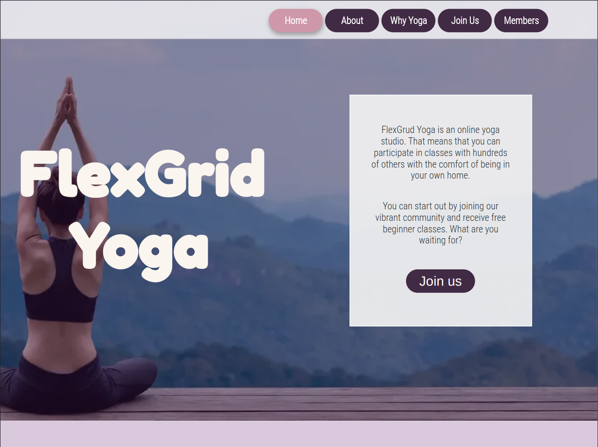
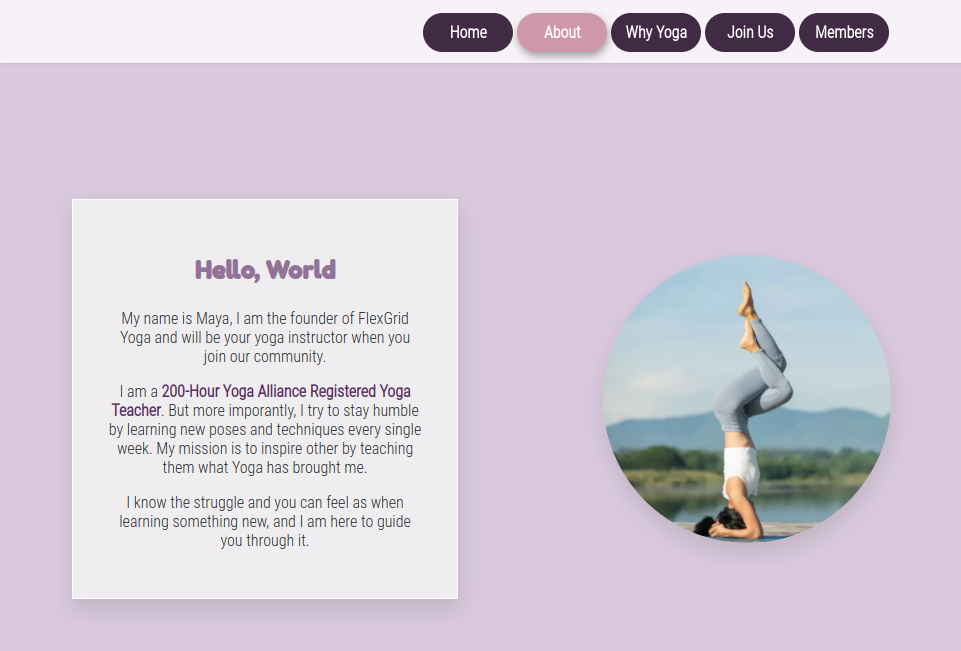
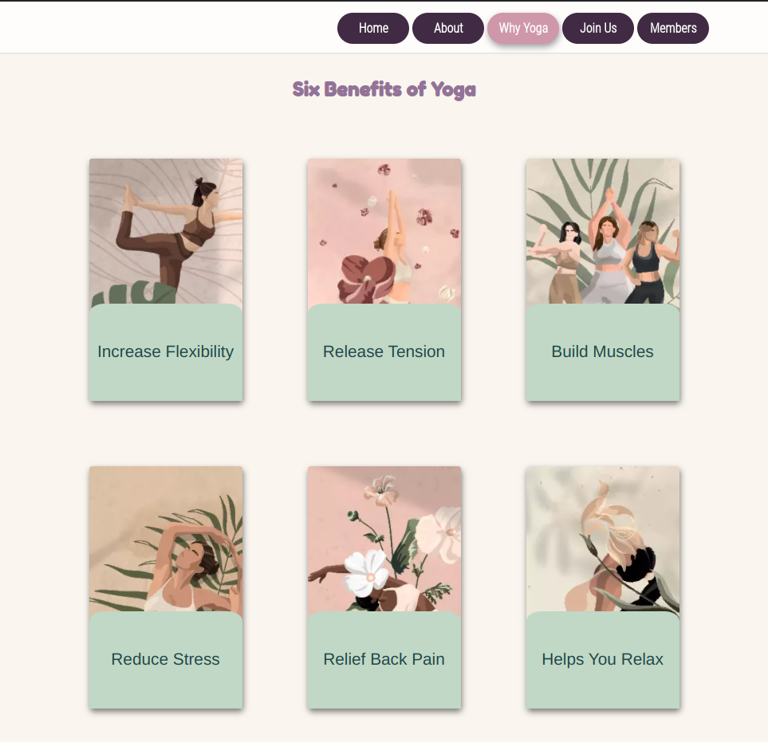
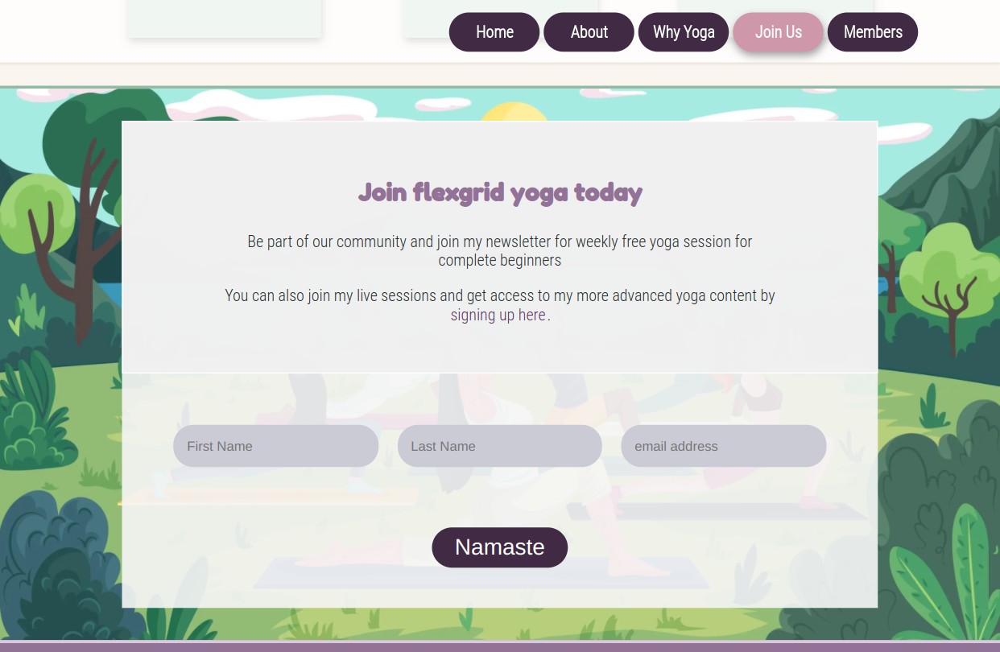
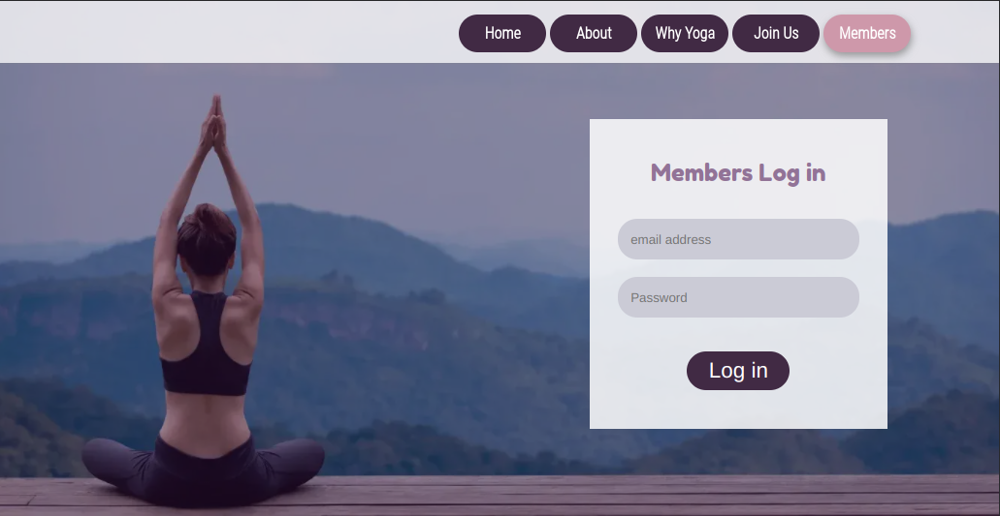
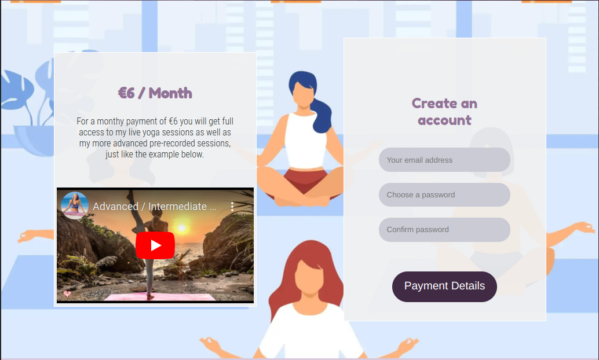
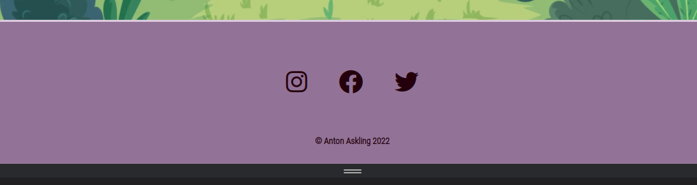

# FlexGrid Yoga

__A website that let's a personal yoga instructor inspire its visitors to become more interested in yoga, and grow her community.__

## Project outline
___
>Typical users are interested in getting involved with online-classes and tutorship in yoga.

- __The typical end user wants to:__

  -  know more about site and yoga instructor
  - be able to subscribe to news coming from community regarding techniques and upcoming yoga sessions
  - get a hint about what is expected inside the paid members area
  - be able to sign up and become a full member, attending live- and pre recorded -yoga sessions
  - connect to community on social medias

- __a typical returning user wants to:__
  - sign in to their account and conduct yoga sessions.

>site owner wants to inspire potential end users who wants to learn yoga and market the benefits of yoga and let users connect with her community and sign up to engage in live and pre-recorded yoga sessions.

- __in short, the site owner wants to:__

  - educate new site visitors about herself
  - give breif overview of the benefits of yoga
  - let new users sign up to newsletter to keep them in the loop of what is happening in the community
  - let users know how they can engage in social media.
  - let existing users log in to view the paid-for content.

## Approach
___

### Design Approach

The design of the website is created with the benefits of yoga in mind. the text should be easy to read and not be distracted by design elements around it. the design features are created to feel relaxed positive and light

__Design features__
- >Elements that contain no text are __soft and rounded__.

- > Text areas are __square and light__ to stand out from the rest of the website and enhance readability. 

- >initially the colors are __few and muted__, as you progress down the site __more colors__ are mixed in to keep visitors curious and __enhance positivity__.

- > Elements have a __lot of space__ around them to feel more relaxed. 

- >Elements that have animations are __slow and subtle__ to make elements feel __relaxing__.

__Fonts__

> __'Fredoka One'__ is a round blocky font that is chosen for the headings on the webpage to blend in with the overall design language.

> Paragraghs, buttons, and other small text areas have the font set to __helvetica__ with a fallback of _Arial_ to maximize readability while not being a distraction from the rest of the website. 

__Colors__
> The choice of colors are inspired by different colors of yoga mats. these colors are often pastel, so they have been altered slightly along the way to enhance contrast and readability.

__Animations__
> animations that take place when a user interacts with certain elements on the website are designed to be slightly slower than on an avarage website to induse a relaxing feeling, which in turn connects back to the overall design approach.

___
### Technical Approach

In order to make the website less cluttered and reduce the amount of scrolling the website is built on two main pages. 

1. > __an index page__   
        the main page, with a single page layout style where the site owner could present herself and the users could get to learn more about her and about yoga. 
2. > __a members page__  
        where existing users can sign in and a new user can choose to sing up and become a full member. 

__Framework__
>This website does not take advantage of any framework. Since this is a small project the it instead takes advantage of CSS3's newly added feature of CSS-grids to create rows for each section. Each section is then made into a flexbox.

>__this approach has 2 main advantages:__
> 1. it removes unnessary code from framwork, which can enhance loading speeds.
> 
> 2. using CSS-grids reduses the amount of divs in the html which makes the syntax more clean and better for screen readers and assistive technologies.

__Responsive design__
> This website is created with a mobile first approach.
>
> Mobile phones usually have less processing power than a tablet, laptop and desktop. By having the CSS load up the mobile design first,  the website renders faster on mobile phones since it can ignore styling that is specified lower down in the style.css document that only applies to larger screens.
> 
>On larger screens, each section takes advantage of the full width of the screen it is being displayed on. But the content inside each section is limited to a width of 1000px. This makes the website look more unified across larger screens and creates a better user experience since the user will have access to all the websites information within 1000px and do not have to pan the head to read.

___

## Website Features
___
> ### Header

The header is designed to be large enought to give breathing room to its elements and feel relaxed, while still hint that there are information visible below that you can scroll to.

 __Contains the following elements:__
 -  an inspiering __background image__ 
 -  a fixed, responsive __navigation menu__  

 - __a welcome heading__  with the company name
  
 -  __a textbox__ with an introduction text 
 
 - a __call-to-action button__ that takes the user to the join us page where 
       the user can choose to subscribe to a newsletter through a form or click a link to go to the sign-up form and become a full paying member. 

__What it accomplish:__
1. > let users know more about the website.
2. > give users a shortcut to join section.       
3. > give the user a way to navigate around the site. 

___
> ### About Section - instructor presentation

In the about section, the yoga instructor get a chance to introduce herself. This section is set higher in the infromation hirarchy than the other sections below since the _instructor_ really is what sets one community appart from anothers.

 __Contains the following elements:__  
 - introduction __text-area__
 - selfie __image__ 

__What it accomplish:__
1. > Let users get to know the instructor.
2. > Let site owner diffirentiate herself from competitors       

___
> ### Benefits section - Why yoga?

This section informs the users of som of the benefits of yoga.

The goal with this is to inspire users interest in the subject. This is done with six interactive cards, each presenting one unique benefit you gain from doing yoga.

 __Contains the following elements:__
 - a section __heading__
 -  interactive and responsive __cards__

__What it accomplish:__
1. > Educate users on the benefits of engaging in yoga.
2. > Give site owner a tool to inspire her visitors.
3. > Make website a bit more interactive.

___
> ### Join Section - first step to get involved

New users might be hesitant to become a full paying member on the first visit. So in order for the site owner to keep users in the loop, and in order to let new users connect and learn more about the future content and what value it would bring to them, they have an option to join a newsletter where the site owner has the potential to reach interested visitors in the future via email.

>

 __Contains the following elements:__
 - a responsive __text-box__ containing information on what _value_ signing up could bring new users.  
 - a __link__ directing interested users to the sign up form on the _Members page_.
 - a responsive __form__ that could feed an emailing list database. this form contains following information:
   - __First name__ _required_
   - __Last name__ 
   - __Email__ _required_
   - __Submit button__

__What it accomplish:__
1. > Educate users on the benefits of engaging in yoga.
2. > Give site owner a tool to inspire her visitors in the future.

__Design feature:__
>Input labels are placed off screen using CSS. The users can't see them, but the screen readers can. Making the section looking clean while keeping functionality. Placeholders shows the user what is expected in the form-fields.
>
>By mixing different vivid colors in the background image, the join section becomes positive and fun to inspire user to commit.
___
>  ### Members page header

The header inherits most of the styling from the index page. but the welcome text box and the website name heading is replaced with a login form.

Existing users can sign in to the website here.

       
__Contains the following elements__ 
- a __fieldset legend__
- __log-in__ form for existing users form contains the following form-elements:
- __Email__ _required_
- __Password__ _required_
- __Submit button__ that submits the form and could validate the user to log in.

__What it accomplish:__
1. > gives existing users an easy way to log in to their accounts.

__Design feature:__
 >Just like on the join section of the index page, the labels are not displayed but still accessable for screen readers and assistive technology for users who needs it. 
___
> ### Members page - sign up section

In this section the user gets is faced with the option to become a paying member of the website and gain full access to its content.

__Contains the following elements__ 
- __information box__ with the following sub-elements:
   - __heading__ letting user know what it costs
   - __text__ explaining the offer
   - __video element__ using an iframe with embedded youtube content that the user can interact with.
- __account creation form__ containing the following sub-elements:
   - an _Account Creation_ __fieldset__ with 3 input fields create the new account.
   - A __detail > summary__ element styled to look like a button that reviels the _payment_ part of the form 
   - a _Payment Card_ __fieldset__ to fill in the payment details
   - a _Billing_ __fieldset__ that let the user fill in the billing adress for the payment.

__What it accomplish:__
1. > Give users an idea of what is behind the paywall.
2. > Give site owner a way to promote the paid-for content.
3. > Let users create a members account.
4. > Let users poivide payment details to become full members.

__Technical Feature:__
>the video element in the information box let's the user get a hint of what to expect as a paying member. The video runs on youtube using iframe and youtubes sharing feature using embedded code which gives the user full controll over play, pause, volume and playing speed functionalities.
___
> ### Footer - Social media links

The footer and the end of the website contains links to the website's social media platforms.

     
 __Contains the following elements__ 
 - List of __links to social media__ pages.
 - __Copy right text__ for the website. ( in this case my own name since this is an excersise.)

__Section Goal:__
1. > Let users connect to website's social media platforms
2. > Give site owner a way to promote her community on social media.

__Design feature:__
> The footer area is designed to be as clean and minimal as possible yet have enough contrast to be clear ans readable.
> animations on the elements has been removed to reduce distractions from the rest of the the website. the mouse still indicate these icons are links through the pointer-change. 
___
### Features Left to Implement

Herea are some ideas that could further improve this website:
- Flip over cards with more information of yoga benefits on the backside
- Members login inside the fixed nav-bar for faster login for existing users.
- Gallery page from social media showcasing the commuinity

## Testing 

Here follows some picure of the website on mobile and tablet to show the website might appear on smaller screens than in the feature section.

 Chrome developer tools Lighthouse report:

In this section, you need to convince the assessor that you have conducted enough testing to legitimately believe that the site works well. Essentially, in this part you will want to go over all of your project’s features and ensure that they all work as intended, with the project providing an easy and straightforward way for the users to achieve their goals.

In addition, you should mention in this section how your project looks and works on different browsers and screen sizes.

You should also mention in this section any interesting bugs or problems you discovered during your testing, even if you haven't addressed them yet.

If this section grows too long, you may want to split it off into a separate file and link to it from here.

### Validator Testing 

- HTML
  - No errors were returned when passing through the official [W3C validator](https://validator.w3.org/nu/?doc=https%3A%2F%2Fcode-institute-org.github.io%2Flove-running-2.0%2Findex.html)
- CSS
  - No errors were found when passing through the official [(Jigsaw) validator](https://jigsaw.w3.org/css-validator/validator?uri=https%3A%2F%2Fvalidator.w3.org%2Fnu%2F%3Fdoc%3Dhttps%253A%252F%252Fcode-institute-org.github.io%252Flove-running-2.0%252Findex.html&profile=css3svg&usermedium=all&warning=1&vextwarning=&lang=en#css)

### Unfixed Bugs

You will need to mention unfixed bugs and why they were not fixed. This section should include shortcomings of the frameworks or technologies used. Although time can be a big variable to consider, paucity of time and difficulty understanding implementation is not a valid reason to leave bugs unfixed. 

## Deployment

This section should describe the process you went through to deploy the project to a hosting platform (e.g. GitHub) 

- The site was deployed to GitHub pages. The steps to deploy are as follows: 
  - In the GitHub repository, navigate to the Settings tab 
  - From the source section drop-down menu, select the Master Branch
  - Once the master branch has been selected, the page will be automatically refreshed with a detailed ribbon display to indicate the successful deployment. 

The live link can be found here - https://code-institute-org.github.io/love-running-2.0/index.html 

## Credits 

In this section you need to reference where you got your content, media and extra help from. It is common practice to use code from other repositories and tutorials, however, it is important to be very specific about these sources to avoid plagiarism. 

You can break the credits section up into Content and Media, depending on what you have included in your project. 

### Content 

- The text for the Home page was taken from Wikipedia Article A
- Instructions on how to implement form validation on the Sign Up page was taken from [Specific YouTube Tutorial](https://www.youtube.com/)
- The icons in the footer were taken from [Font Awesome](https://fontawesome.com/)

### Media

- The photos used on the home and sign up page are from This Open Source site
- The images used for the gallery page were taken from this other open source site

Congratulations on completing your Readme, you have made another big stride in the direction of being a developer! 

## Other General Project Advice

Below you will find a couple of extra tips that may be helpful when completing your project. Remember that each of these projects will become part of your final portfolio so it’s important to allow enough time to showcase your best work! 

- One of the most basic elements of keeping a healthy commit history is with the commit message. When getting started with your project, read through [this article](https://chris.beams.io/posts/git-commit/) by Chris Beams on How to Write  a Git Commit Message 
  - Make sure to keep the messages in the imperative mood 

- When naming the files in your project directory, make sure to consider meaningful naming of files, point to specific names and sections of content.
  - For example, instead of naming an image used ‘image1.png’ consider naming it ‘landing_page_img.png’. This will ensure that there are clear file paths kept. 

- Do some extra research on good and bad coding practices, there are a handful of useful articles to read, consider reviewing the following list when getting started:
  - [Writing Your Best Code](https://learn.shayhowe.com/html-css/writing-your-best-code/)
  - [HTML & CSS Coding Best Practices](https://medium.com/@inceptiondj.info/html-css-coding-best-practice-fadb9870a00f)
  - [Google HTML/CSS Style Guide](https://google.github.io/styleguide/htmlcssguide.html#General)

Getting started with your Portfolio Projects can be daunting, planning your project can make it a lot easier to tackle, take small steps to reach the final outcome and enjoy the process! 