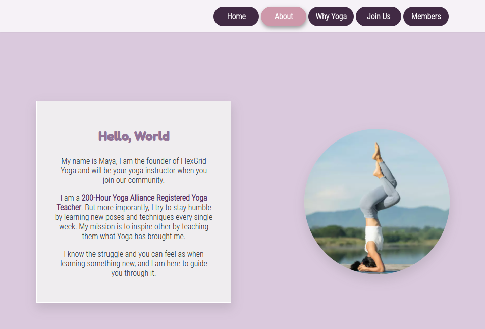
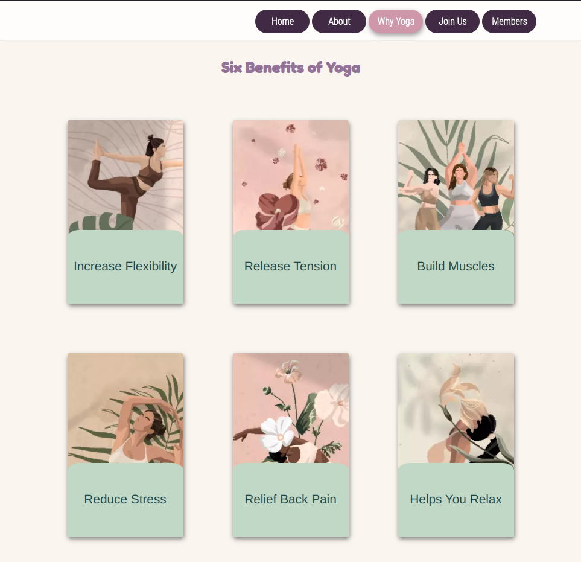
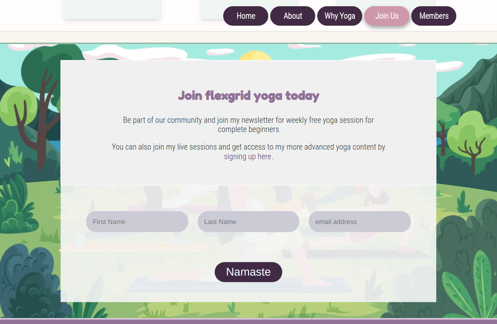
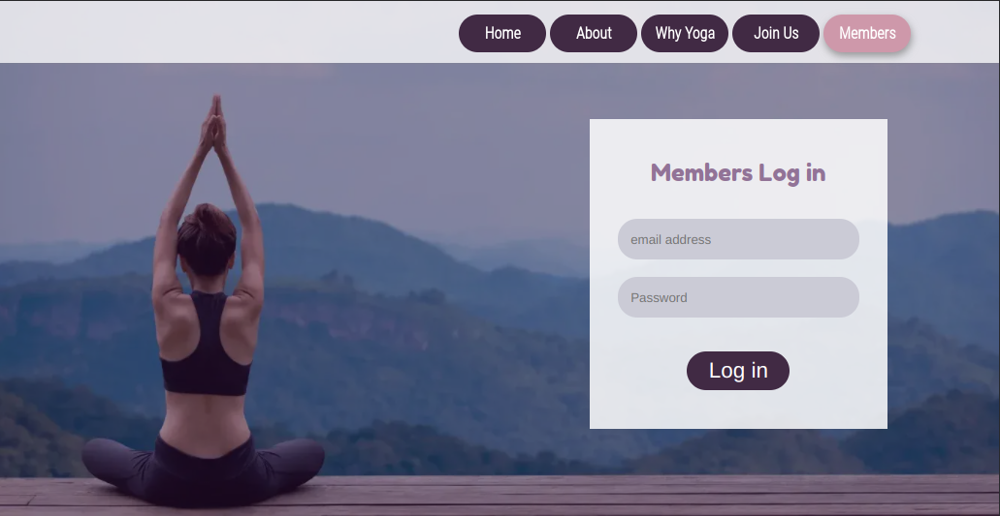
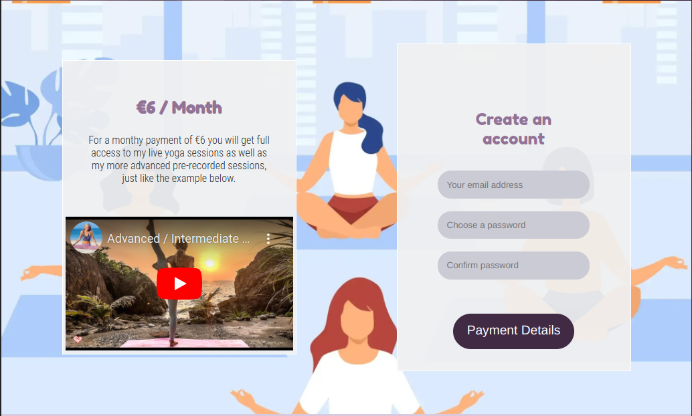

# FlexGrid Yoga - a website for a personal yoga instructor
First milestone project at Code Institute showcasing a responsive website using vanilla HTML5 and CSS3.

__Live link to the website:__ https://4ntm4n.github.io/ms-one/assets/html/sign-up.html

___

## project outline:

I decided to work from one of the pre-defined project suggestions because  I wanted to put myself in a scenario where I create a website for a client that does not share my personal interest or design preferences. For me this meant a greater challange and what I can imagine is a more life like scenario in web development.

### end user goals  : 

>Typical users are interested in getting involved with online-classes and tutorship in yoga.

- __The typical end user wants to:__

  -  know more about site and yoga instructor
  - be able to subscribe to news coming from community regarding techniques and upcoming yoga sessions
  - get a hint about what is expected inside the paid members area
  - be able to sign up and become a full member, attending live- and pre recorded -yoga sessions
  - connect to community on social medias

- __a typical returning user wants to:__
  - sign in to their account and conduct yoga sessions.

### site owners goals:
>site owner wants to inspire potential end users who wants to learn yoga and market the benefits of yoga and let users connect with her community and sign up to engage in live and pre-recorded yoga sessions.

- __in short, the site owner wants to:__

  - educate new site visitors about herself
  - give breif overview of the benefits of yoga
  - let new users sign up to newsletter to keep them in the loop of what is happening in the community
  - let users know how they can engage in social media.
  - let existing users log in to view the paid-for content.

___

### Design And Content

My goal as a webdeveloper was to create a clutter free minimalistic website. Since the Website is Yoga / mindfullness oriented, I wanted the information provided to have lots of breathing room and the animation on elements to be somewhat slower than on a normal website to make it feel calm and relaxing. I also wanted the colors to be positive. For the color scheme I was inspired by different colors of yoga mats.

>I decided that the best way to adress the users and site owners needs was to device the website into two main parts.

1.  __an index page__   
        the main page, with a single page layout style where the site owner could present herself and the users could get to learn more about her and about yoga. 
2. __a members page__  
        where existing users could sign in and a new user could choose to sing up and become a full member. I wanted this to be a separate page since it mostly contains of form elements and a separate page for this would reduce clutter on the website, making it look and feel cleaner
___
### __design features__
- >Elements that contain no text are __soft and rounded__.

- > Text areas are __square and light__ to stand out from the rest of the website and enhance readability. 

- >initially the colors are __few and muted__, as you progress down the site __more colors__ are mixed in to keep visitors curious and __enhance positivity__.

- > Elements have a __lot of space__ around them to feel more relaxed. 

- >Elements that have animations are __slow and subtle__ to make elements feel __relaxing__.

___
### __The index page consist of five sections:__ 

  

  <b>1.1 Header - an inspiering welcome</b> 
  

  
 

>This is the first section of the website a user is presented to. I wanted it too look clean and relaxing.

 __Contains the following elements:__
 -  an inspiering __background image__ 
 -  __navigation menu__  that lets the user jump to the different sections

 - __a welcome heading__ -in this case the website's name -FlexGrid Yoga 
        instead of having a logo in the navigation bar
 -  __a textbox__ with a welcome text 
 
 - a __call-to-action button__ that takes the user to the join us page where 
       the user can choose to subscribe to a newsletter through a form or click a link to go to the sign-up form and become a full paying member. 

__Section Goal:__
1. > let users know more about the website.
2. > give users a shortcut to join section.       
3. > give the user a way to navigate around the site. 

__Design:__
> This section aims to have enough space to give breathing room to all elements presented, but also be small enough to let user hint the sections below to encourage a scroll down.

 

 <b>1.2 About section  - introduction to the tutor.</b>
 

 

>This section will let the users know who the site owner / instructor is through a breif presentation.
>>I argue that this section has the higher informative priority over the other sections below since there are many different online yoga classes out there, and the first impression a user gets from the instructor is a key differentiator from other similar sites.

 __Contains the following elements:__  
 - introduction __text-area__
 - selfie __image__ 

__Section Goal:__
1. > Let users get to know the instructor.
2. > Let site owner diffirentiate herself from competitors       

__Design:__
>Follow the same design-pattern as the rest of the site yet have a uniqueness to it from other sections. Be clear, simple and have a light relaxing feel to it.

 
 
 
 <b>1.3 Benefits section - six benefits of yoga. </b>
 

 

>This section informs the users of som of the benefits of yoga
>
>To make this section a bit more interesting, I created a floating effect by moving the cards ever so slightly upwards and added more box-shadow when the user hovers the pointer over the them with the mouse. 

 __Contains the following elements:__
 - a section __heading__
 - six different __cards__ that each explains one unique benefit of yoga.

__Section Goal:__
1. > Educate users on the benefits of engaging in yoga.
2. > Give site owner a tool to inspire her visitors.
3. > Make website a bit more interactive.

__Design:__
> the goal with this is to inspire users interest in the subject. I wanted to do this with a card design that looked good and was easy to both design and reuse. 

 

  <b>1.4 Join Section - join community and newsletter</b>
  

 
 
  

>New users might be hesitant to become a full paying member on the first visit. So in order for the site owner to keep users in the loop, and in order to let new users connect and learn more about the future content and what value it would bring to them, they have an option to join a newsletter where the site owner has the potential to reach interested visitors in the future via email.

 __Contains the following elements:__
 - a __text-box__ containing information on what _value_ signing up could bring new users.  
 - a __link__ directing interested users to the sign up form on the _Members page_.
 - a __form__ that could feed an emailing list database. this form contains following information:
   - __First name__ _required_
   - __Last name__ 
   - __Email__ _required_
   - __Submit button__

__Section Goal:__
1. > Educate users on the benefits of engaging in yoga.
2. > Give site owner a tool to inspire her visitors.
3. > Make website a bit more interactive.

__Design:__
>In order to make this section feel clean yet have the sufficiant support for screen readers, the legends and labels are placed off screen using css. Placeholders show the user what is expected in the form-fields.
>By mixing a lot of different colors in the background image, the join section becomes positive and fun.

<b>1.5 footer - links to social media </b>

>The footer and the end of the website contains links to the website's social media platforms.
     
 __Contains the following elements__ 
 - List of __links to social media__ pages.
 - __Copy right text__ for the website. ( in this case my own name since this is an excersise.)

__Section Goal:__
1. > Let users connect to website's social media platforms
2. > Give site owner a way to promote her community on social media.

__Design:__
> The footer area is designed to be as clean as possible yet have enough contrast to be clear ans readable. 
> animations on the elements has been removed to reduce distractions from the rest of the the website. the mouse still indicate these icons are links through the pointer-change. 

 

___

### __The Members page consist of three sections:__ 

<b>2.1 Header - Sign in </b>

>The header on the members page is the same as on the index page. but the welcome text box and the website name heading is replaced with a login form.
       
__Contains the following elements__ 
- a __fieldset legend__
- __log-in__ form for existing users form contains the following form-elements:
- __Email__ _required_
- __Password__ _required_
- __Submit button__ that submits the form and could validate the user to log in.

__Section Goal:__
1. > give existing users an easy way to log in to their accounts.

__Design:__
 >Just like on the join section of the index page, the labels are not displayed but still accessable for screen readers and assistive technology for users who needs it. 

 

<b>2.2 Sign-up section - create an account </b>

>In this section the user gets is faced with the option to become a paying member of the website and gain full access to its content.

__Contains the following elements__ 
- __information box__ with the following sub-elements:
   - __heading__ letting user know what it costs
   - __text__ explaining the offer
   - __video element__ using an iframe with embedded youtube content that the user can interact with.
- __account creation form__ containing the following sub-elements:
   - an _Account Creation_ __fieldset__ with 3 input fields create the new account.
   - A __detail > summary__ element styled to look like a button that reviels the _payment_ part of the form 
   - a _Payment Card_ __fieldset__ to fill in the payment details
   - a _Billing_ __fieldset__ that let the user fill in the billing adress for the payment. 

__Section Goals:__
1. > Give users an idea of what is behind the paywall.
2. > Give site owner a way to promote the paid-for content.
3. > Let users create a members account.
4. > Let users privide payment details to become full members.

__Design:__
>the video element in the information box let's the user get a hint of what to expect as a paying member. The video runs on youtube using iframe and youtubes sharing feature using embedded code.
>
>The payment details button could have been executed in a more elegant way using javascript but since I limited myself to pure html and css, styling the summary element to look like a button was the solution I came up with.

 

<b>2.3 footer - links to social media </b>

>The footer on the members page is identical to the one on the index page to provide users with concistancy. 

__Section Goal:__
1. > Let users connect to website's social media platforms
2. > Give site owner a way to promote her community on social media.

__Design:__
> The footer area is designed to be as clean as possible yet have enough contrast to be clear ans readable. 
> animations on the elements has been removed to reduce distractions from the rest of the the website. the mouse still indicate these icons are links through the pointer-change. 
       

 

## Testing

no errors in the css with jigsaw validator.
https://jigsaw.w3.org/css-validator/validator?uri=https%3A%2F%2F4ntm4n.github.io%2Fms-one%2Findex.html&profile=css3svg&usermedium=all&warning=1&vextwarning=&lang=sv

these people will be credited if I use their images from freepik
<a href='https://www.freepik.com/vectors/flower'>Flower vector created by rawpixel.com - www.freepik.com</a>
<a href='https://www.freepik.com/vectors/yoga-studio'>Yoga studio vector created by pch.vector - www.freepik.com</a>
<a href='https://www.freepik.com/photos/yoga-nature'>Yoga nature photo created by jcomp - www.freepik.com</a>
<a href='https://www.freepik.com/vectors/open-air'>Open air vector created by pikisuperstar - www.freepik.com</a>

how to ease everything on hover:
https://stackoverflow.com/questions/41267357/css-ease-in-and-out-on-hover

using media queries:
https://developer.mozilla.org/en-US/docs/Web/CSS/Media_Queries/Using_media_queries

styling input fields:
https://www.w3schools.com/css/css_form.asp

hiding elemens off screen so that they dont take up screen realestate when they have visibility:hidden property set to them:

https://stackoverflow.com/questions/6746649/how-can-i-hide-an-element-off-the-edge-of-the-screen

adding script to bottom of the page:
https://stackoverflow.com/questions/38407962/when-to-use-the-script-tag-in-the-head-and-body-section-of-a-html-page#:~:text=Put%20your%20functions%20in%20the,not%20interfere%20with%20page%20content.&text=If%20your%20is%20not%20placed,of%20the%20element.

center an image from html through css
https://www.w3schools.com/howto/howto_css_image_center.asp

smooth-scrolling:
https://gomakethings.com/smooth-scrolling-links-with-only-css/

hamburger menu:
found this burger menu method, imported it and modified it to suit this website.
https://codepen.io/alvarotrigo/pen/wvrzPWL

benfits of yoga:
https://www.hopkinsmedicine.org/health/wellness-and-prevention/9-benefits-of-yoga